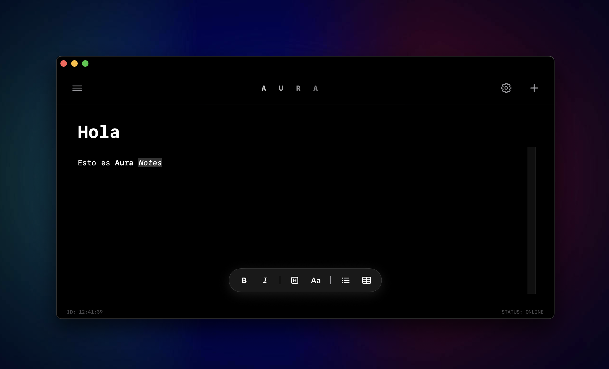

# AURA NOTES ⟁

> **"Memory Bank for the Digital Age."**
> Un editor de notas minimalista con estética cyberhacker, persistencia nativa y flujo de trabajo optimizado para teclado.

---

## 🖥️ Preview

## ⚡️ Funcionalidades del Sistema

**AuraNotes** es una herramienta de enfoque absoluto diseñada para el "Flow State" con una interfaz de alto contraste inspirada en terminales de seguridad.

* **Cyberhacker UI:** Diseño en negro puro, fuentes monoespaciadas y barras de estado dinámicas.
* **Aura Editor (Motor AppKit):** Implementación avanzada de `NSTextView` mediante `NSViewRepresentable` para soporte real de texto enriquecido (RTF).
    * Soporte para **Negrita**, *Cursiva*, Títulos, Listas y Tablas nativas.
* **Persistencia SwiftData:** Gestión de base de datos local robusta utilizando el modelo `@Model` de `Note`.
* **Sistema de Atajos Dinámico:** Configuración de comandos `CMD` personalizables con validación de entrada.
* **Feedback Háptico/Visual:** Efecto de temblor (`ShakeEffect`) y sonidos de sistema ante entradas inválidas.
* **Interfaz Inmersiva:** Ventana con barra de título oculta y modo oscuro forzado.

## 🛠 Especificaciones Técnicas

* **Core:** Swift 5.0 / macOS 15.6+.
* **UI Framework:** SwiftUI como orquestador principal.
* **Bridge:** `AppKit` para la manipulación avanzada del motor de texto.
* **Data:** `SwiftData` para la gestión del modelo persistente.

## 🚀 Instalación y Despliegue

### Compilación para Desarrolladores
1. Clona el repositorio.
2. Abre `AuraNotes.xcodeproj` en Xcode.
3. Ejecuta `Cmd + R`.

### Generar Instalador (.pkg)
Para crear un paquete de instalación distribuible:

1. **Archivar:** En Xcode, selecciona `Product` -> `Archive`.
2. **Exportar:** Selecciona `Distribute App` -> `Copy App`.
3. **Empaquetar:** Guarda la app en `~/Desktop/Payload/AuraNotes.app` y ejecuta:
`productbuild --component ~/Desktop/Payload/AuraNotes.app /Applications ~/Desktop/AuraNotes_Installer.pkg`

## ⌨️ Comandos del Sistema (Configurables)

| Acción | Comando (Default) | Descripción |
| :--- | :---: | :--- |
| New Entry | CMD + N | Inicializa una nueva nota en el banco de memoria. |
| Open List | CMD + L | Despliega el panel de navegación de notas. |
| Save Data | CMD + S | Fuerza el guardado de la sesión actual. |

## 📂 Arquitectura de Archivos

* `ContentView.swift`: Interfaz de usuario principal y lógica de atajos.
* `AuraEditor.swift`: Puente `NSViewRepresentable` para el motor de texto.
* `AuraComponents.swift`: Botones animados y efectos de UI.
* `Note.swift`: Definición del esquema de datos persistente.
* `AuraNotesApp.swift`: Punto de entrada de la aplicación y configuración de ventana.

---

## 👤 Autor

**Desarrollado con ❤️ por José Manuel Jiménez Rodríguez**

*"System status: All systems operational. End of line."* █
